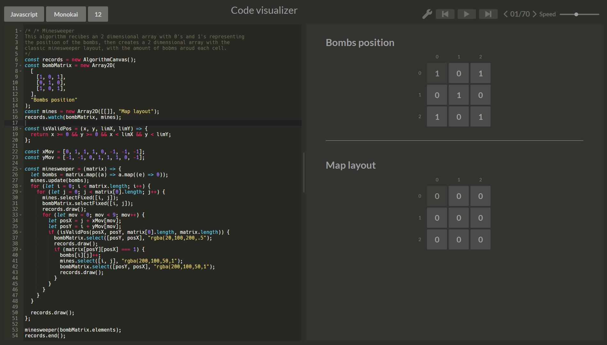

# Algorithm Visualizer

Code visualizer improve algorithms and data structures understanding with visualization of data structures with minimum change to the code. Write an algorithm, add some lines of code and you're ready to go.
To learn how to use you can read the README.md below or visite the homepage.
[demo](https://erick.borquez.dev/el-algoritmo-del-ritmo/)

This project is based on [react-data-structures](https://github.com/ErickJoestar/react-data-structures) to visualize the data structures.



<br/>

## What languajes are supported?

Algorithm visualizer currently supports only **Javascript**, i have plans to implement C++ and Python in the future.

<br/>

## How can i visualize the code?

Well, you have to write you algorithm, then add a few lines of code, some of then are functions and you have to pass your structure, another are only to "select" elements in the structure

First of all you have to create an AlgorithmCanvas that will **watch for changes** on the structures that you want

```javascript
canvas = new AlgorithmCanvas();
```

<br/>

To watch for a structure you have to create one

```javascript
ArrayOneDimension = new Array1D();
ArrayOneDimension.update(yourArray);
canvas.watch(ArrayOneDimension);
```

where Array1D are a class implement in Algorithm Visualizer.
then you have to update the argument in ArrayOneDimension

<br/>

To **select** an index simply use

```javascript
ArrayOneDimension.select(index);
canvas.update();
```

Where index not only can be an index of the array, it can be **multiple indexes**, for example

```javascript
ArrayOneDimension.select([2, 4, 7]);
canvas.update();
```

Here in the canvas te elements 2, 4 and 7 will be selected.
<br/>

Another way to select an element is with **functions**, you can pass a function as first argument in ArrayOneDimension
and it should be evaluated to true or false in order to select an item

```javascript
ArrayOneDimension.select((i) => i % 2 == 0);
canvas.update();
```

Here all the items in the array where the index is even will be selected.
<br/>

The **arguments passed to the function** evaluated in the first argument in Structure.select is the index and the value holded by the element itsel

```javascript
ArrayOneDimension.select((i, e) => e > 5);
canvas.update();
```

Here all the items in the array where the value are greather tan 5 will be selected

<br/>

## How can i style the selection?

In order to style an element that is beign selected by an structure yo can pass a second and third argument to Structure.select, the value should be in **HEX, RGBA or an standard color name**, and it will change the **background** and **color** respectively.

```javascript
ArrayOneDimension.select(5, "red", "#BADA55");
ArrayOneDimension.select(6, "rgb(0,0,0)", "rgba(255,255,255,0.5)");
canvas.update();
```

<br/>

## How do i select an element in a Array with 2 Dimensions (Array2D)?

To select an element the first parameter of Array2D.select must be an array, the first element will be the position in the Y axis, and the second element will be the X axis.

```javascript
ArrayTwoDimensions = new Array2D([
  [1, 2, 3],
  [4, 5, 6],
  [7, 8, 9],
]);
ArrayTwoDimension.select([1, 1]);
canvas.update();
```

<br/>

To select multiple elements you have to do something similary to Array1D, but in this case you have to pass an array of arrays, where each element of the first array will be a position to select.

```javascript
ArrayTwoDimension.select([
  [0, 0],
  [1, 1],
  [2, 2],
]);
canvas.update();
```

<br/>

The argument passed to a function as parameter of Array2D.select will be an array of lenght 2, where the first element will be the position in the Y axis, and the second the position in the X axis, the second argument will be the value holded in that position.

```javascript
ArrayTwoDimension.select(([y, x], value) => y == x);
canvas.update();
```

## What structures are supported?

Currently the application unly supports Arrays with one dimension and arrays with two dimensions.<br/>
In the future im planning to add something like a **console** where the user can put messages.<br/>
Every structure in [react-data-structures](https://github.com/ErickJoestar/react-data-structures) willl be supported in future updated.

<br/>
